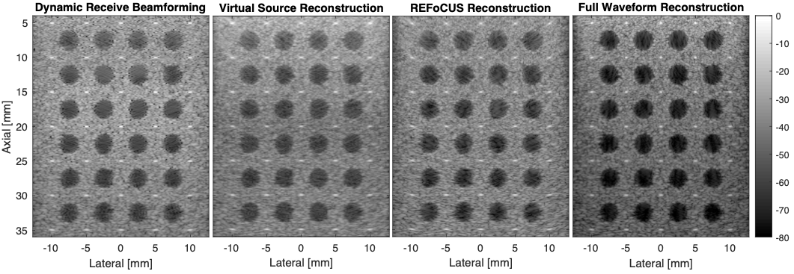

# FourierDomainBeamformer
Generalized Fourier Beamformer Based on the Cross-Correlation of Transmitted and Received Wavefields

Fourier beamforming is generally used to form medical ultrasound images using specific transmission sequences. Fourier beamforming is distinct from delay-and-sum beamforming in that the diffraction process is used to focus ultrasound signals rather than selecting signal values based on times-of-flight. The Fourier beamformer shown here is applicable to any transmit sequence as long as the element-wise transmit apodizations and delays are known along with their corresponding receive channel data.

We provide sample data and algorithms presented in

> Ali, R. "Fourier-Based Synthetic-Aperture Imaging forArbitrary Transmissions by Cross-Correlation ofTransmitted and Received Wave-Fields". *Manuscript submitted for publication.*

for the reconstruction ultrasound images based on conventional dynamic-receive beamforming, virtual source synthetic aperture, REFoCUS (https://github.com/nbottenus/REFoCUS), and the proposed Fourier beamforming technique (called full-waveform reconstruction in the paper)

If you use the code/algorithm for research, please cite the above paper. 

You can reference a static version of this code by its DOI number:
INSERT DOI HERE

# Sample results
The Fourier beamforming technique provided here is equivalent to the time-domain cross-correlation image reconstruction process shown here:

Here we show results for conventional dynamic-receive beamforming, virtual source synthetic aperture, REFoCUS (https://github.com/nbottenus/REFoCUS), and the proposed Fourier beamforming technique ("full-waveform reconstruction" in the paper)

